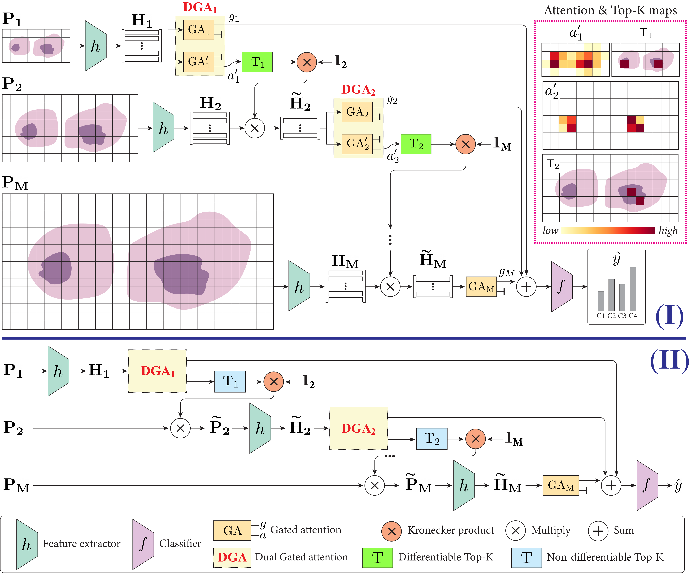

# ZoomMIL

ZoomMIL is a multiple instance learning (MIL) method that learns to perform multi-level zooming for efficient Whole-Slide Image (WSI) classification. 
This repository contains the code to reproduce the results of our corresponding paper [Differentiable Zooming for Multiple Instance Learning on Whole-Slide Images](https://arxiv.org/pdf/2204.12454.pdf).

## Overview


## Installation

### histocartography

This code relies on functionality from the histocartography library. To install it, simply clone the github repository and add the path to your `PYTHONPATH`:

```
git clone https://github.com/histocartography/histocartography.git
export PYTHONPATH="<PATH>/histocartography:$PYTHONPATH"
```

### conda environment
Create a conda environment and install the required packages from the provided `environment.yml`:

```
git clone https://github.com/histocartography/zoommil.git && cd zoommil
conda env create -f environment.yml
conda activate zoommil
```

Install the remaining packages:

```
conda install -n zoommil pytorch==1.10.1 torchvision==0.11.2 cudatoolkit=11.1 -c pytorch -c conda-forge
conda install -n zoommil -c conda-forge conda-forge/linux-64::openslide-python
```

## Getting started

After cloning the repository and creating the conda environment, you can follow the steps below to get started.

### Datasets
We evaluated ZoomMIL on three publicly available datasets:

- **CRC**: 
    - 1133 colorectal biopsy and polypectomy slides from non-neoplastic, low-grade, and high-grade lesions
    - The dataset can directly be requested from the authors of [CAD systems for colorectal cancer from WSI are still not ready for clinical acceptance](https://www.nature.com/articles/s41598-021-93746-z)

- **BRIGHT**:
    - 703 Breast WSIs from non-cancerous, precancerous, and cancerous subtypes
    - Data: https://brightchallenge.na.icar.cnr.it/BRIGHT_Challenge/
    - We only used data from the subfolders **"WSIs"** (not ROIs) under Train/Validation/Test
    - Note that the test labels of BRIGHT are currently not public, but the [BRIGHT challenge](https://research.ibm.com/haifa/Workshops/BRIGHT/challenge.html) may reopen for submissions
    
- **CAMELYON16**: 
    - 399 Breast WSIs with normal and metastatic cases
    - Data: https://camelyon17.grand-challenge.org/Data/ (contains images from both CAMELYON16 and CAMELYON17)

The train/val/test splits for all datasets can be found [here](https://ibm.box.com/s/ejjgh5699q9gs76cm4fp2kffru24pd0t).

### Preprocessing
Whole-slide images (e.g., from the BRIGHT dataset) can be preprocessed (tissue masking + patch feature extraction) as .h5 files:

```
python bin/preprocess.py --out_path <PATH_TO_PREPROCESSED_DATA> --in_path <PATH_TO_DOWNLOADED_DATA> --mode features --dataset BRIGHT
```

To only extract patches (without features), select the mode `patches`:

```
python bin/preprocess.py --out_path <PATH_TO_PREPROCESSED_DATA> --in_path <PATH_TO_DOWNLOADED_DATA> --mode patches --dataset BRIGHT
```

## Training & testing
Adapt the paths in your config file, then run `train.py` to run the training and testing for ZoomMIL. This script expects WSIs that have been preprocessed as patch **features**.

```
python bin/train.py --config_path zoommil/config/sample_config.json
```

## Citation
If you use this code, please consider citing our work:

```
@article{thandiackal2022zoommil,
  title={Differentiable Zooming for Multiple Instance Learning on Whole-Slide Images},
  author={Thandiackal, Kevin and Chen, Boqi and Pati, Pushpak and Jaume, Guillaume and Williamson, Drew FK and Gabrani, Maria and Goksel, Orcun},
  journal={arXiv preprint arXiv:2204.12454},
  year={2022}
}
```